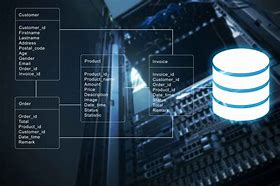

# Base de Datos

En esta materia se muestra el diseño e 
implementacion de bases de datos en los
sistemas gestores de bases de datos
Microsoft SQL Server y MYSQL

Los temas que incluyen los repositorios son:

1. Ánalisis de Requerimienttos
2. Modelo E-R
3. Modelo relacional
4. Normalizacion
5. Restricciones
6. Lenguaje SQL-LDD
7. Lenguaje SQL-LMD